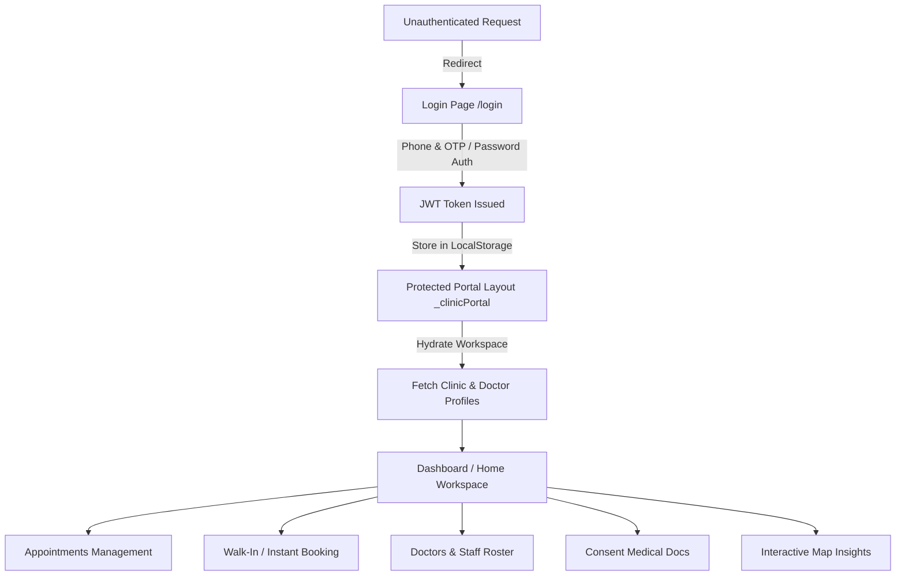
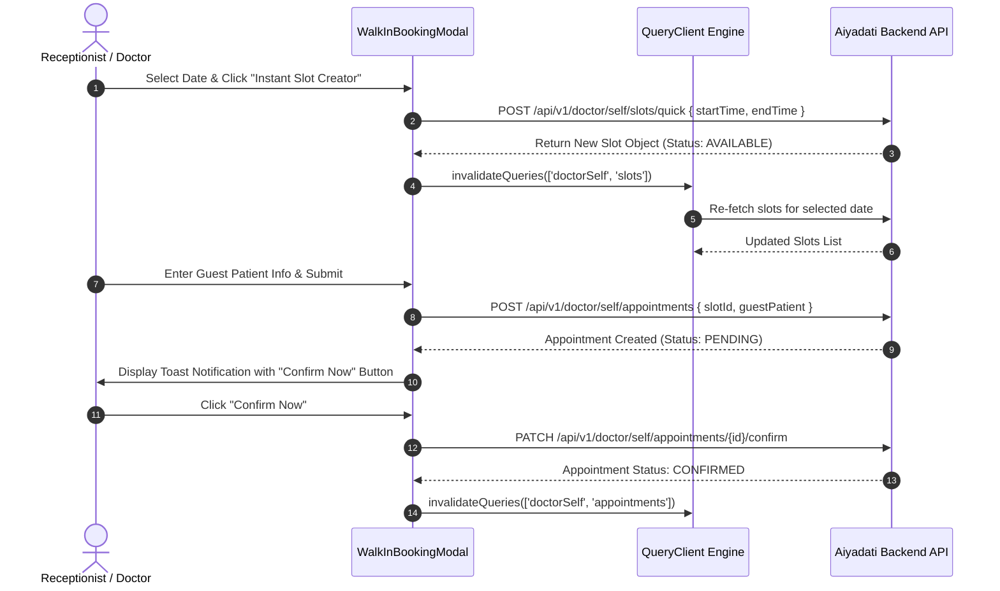
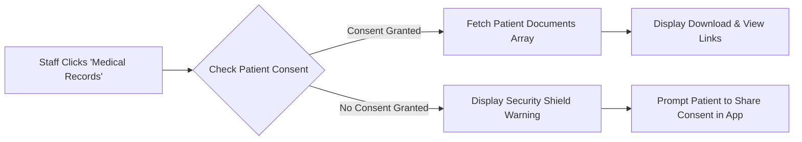

# 🏥 Aiyadati Clinic Portal & Doctor Command Center

<div align="center">


<p align="center">
  <b>A state-of-the-art, high-performance, real-time medical operating platform for modern clinics, multi-specialty centers, and medical practitioners across Algeria.</b>
</p>

</div>

---

## 📖 Table of Contents
- [🏛️ Executive Summary & Analogy](#️-executive-summary--analogy)
- [🧠 Micro-Query Engine & Core Architecture](#-micro-query-engine--core-architecture)
- [🔄 Project Lifecycle & Operating Workflow](#-project-lifecycle--operating-workflow)
- [📊 System Architecture Diagrams](#-system-architecture-diagrams)
- [📁 Asset & Codebase Structural Map](#-asset--codebase-structural-map)
- [🚀 Quick Start & Development Setup](#-quick-start--development-setup)
- [🔐 Security & Data Consent Model](#-security--data-consent-model)

---

## 🏛️ Executive Summary & Analogy

> [!NOTE]
> **The Hospital Control Tower Analogy**  
> Imagine an **Air Traffic Control Tower** governing a busy international hub: every incoming patient is an approaching aircraft, every consultation slot is an allocated runway, every doctor's room is a gate terminal, and every medical record is a encrypted flight manifest.
>
> **Aiyadati Clinic** acts as the digital nerve center that orchestrates this entire ecosystem in real-time without latency, friction, or communication breakdown.

Aiyadati Clinic is engineered to empower healthcare administrators and medical practitioners with total operational clarity:
- **Instant Consultation Management**: Reserve, confirm, reschedule, or cancel appointments with live calendar synchronization.
- **Walk-in & Phone Booking Engine**: Instant creation of ad-hoc consultation slots for queue management.
- **Consent-Gated Patient Records**: Secure access to patient medical documents protected by digital consent verification.
- **Interactive Patient & Slot Mapping**: Mapbox GL spatial visualization for patient distribution and local availability across Algerian Wilayas and Baladyas.

---

## 🧠 Micro-Query Engine & Core Architecture

The application operates on a **zero-dependency, ultra-lightweight custom React Query Engine** built directly into [`src/lib/queryClient.tsx`](file:///Users/salah/Desktop/Real_World_Projects/Aiyadati/Aiyadati-clinic/src/lib/queryClient.tsx).

```
 ┌────────────────────────────────────────────────────────────────────────┐
 │                    React 19 Component Hierarchy                       │
 └───────────────────────────────────┬────────────────────────────────────┘
                                     │ useQuery() / useMutation()
                                     ▼
 ┌────────────────────────────────────────────────────────────────────────┐
 │                    Lightweight Query Client Core                       │
 │  ┌───────────────────────────┐    ┌──────────────────────────────────┐ │
 │  │ Memory Cache Map          │    │ Active Query Listener Registry   │ │
 │  │ key -> { data, timestamp }│    │ key -> Set<() => void>           │ │
 │  └───────────────────────────┘    └──────────────────────────────────┘ │
 └───────────────────────────────────┬────────────────────────────────────┘
                                     │ Axios Client With Bearer Auth
                                     ▼
 ┌────────────────────────────────────────────────────────────────────────┐
 │                     Aiyadati Backend REST APIs                         │
 └────────────────────────────────────────────────────────────────────────┘
```

### Key Engine Features:
- ⚡ **Zero External Heavyweight Dependencies**: Completely replaces third-party state managers with native React hooks (`useSyncExternalStore` / `useState` & `useEffect`).
- 🔄 **Automated Cache Invalidation**: Calling `queryClient.invalidateQueries({ queryKey })` immediately re-fetches affected active listeners across the entire DOM tree.
- 🎯 **Predictable Stale-Time Management**: Built-in cache freshness guard preventing redundant network calls while keeping user interfaces hyper-responsive.

---

## 🔄 Project Lifecycle & Operating Workflow



### Lifecycle Phases:
1. **Ingestion & Authentication Phase**: Users authenticate via OTP or password credentials. Valid JWTs are persisted, establishing immediate session state.
2. **Context Hydration Phase**: The system fetches workspace details, active doctor assignments, clinic opening hours, and room configurations.
3. **Operational Dispatch Phase**: Staff manage daily schedules, issue walk-in queue tickets, upload prescriptions, and confirm patient visits.
4. **Analytics & Spatial Phase**: Live visual reporting on clinic revenues, patient demographics, and appointment completion rates.

---

## 📊 System Architecture Diagrams

### 1. Walk-In & Instant Slot Booking Sequence



### 2. Medical Record Consent Verification Flow



---

## 📁 Asset & Codebase Structural Map

```
aiyadati-clinic/
├── public/                     # Static brand assets & favicons
├── src/
│   ├── api/                    # Type-safe API integrations (Axios)
│   │   ├── client.ts           # Axios instance with auth interceptors
│   │   ├── clinicSelfApi.ts    # Clinic workspace management
│   │   ├── consentApi.ts       # Patient medical record consent API
│   │   ├── doctorSelfApi.ts    # Doctor schedule, slots & appointment API
│   │   └── locationApi.ts      # Wilaya & Baladya geo-location services
│   ├── components/             # Modular React UI components
│   │   ├── appointments/       # Booking & schedule modals
│   │   ├── data/               # Tables, badges, drawers & pickers
│   │   ├── glass/              # Modern glassmorphism UI primitives
│   │   ├── patients/           # Patient detail & medical doc drawers
│   │   ├── shell/              # Navigation bar, sidebar & command palette
│   │   └── ui/                 # Core design system components
│   ├── hooks/                  # Clean custom data-fetching hooks
│   ├── lib/                    # Core utilities & query engine
│   │   ├── queryClient.tsx     # Custom zero-dep Query Client & Provider
│   │   ├── queryKeys.ts        # Type-safe query key factory
│   │   └── utils.ts            # Tailwind & class merge utilities
│   ├── routes/                 # React Router v7 view pages
│   │   ├── _clinicPortal.tsx   # Protected layout wrapper with Sidebar/Topbar
│   │   ├── appointments.tsx    # Comprehensive appointments calendar/table
│   │   ├── dashboard.tsx       # Live clinic performance analytics
│   │   ├── doctors.tsx         # Staff directory & invitation modal
│   │   ├── login.tsx           # Authentication portal
│   │   ├── patients.tsx        # Patient management & medical history
│   │   ├── rooms.tsx           # Consultation room configuration
│   │   └── schedule.tsx        # Working hours & slot management
│   ├── App.tsx                 # Central React Router v7 routes declaration
│   └── main.tsx                # Entrypoint mounting QueryClientProvider & App
├── index.html                  # HTML5 entrypoint with Google Fonts
├── package.json                # Project dependencies & NPM scripts
├── vite.config.ts              # Vite 8 build configuration
└── README.md                   # System documentation
```

---

## 🚀 Quick Start & Development Setup

### Prerequisites
- **Node.js**: `v20.x` or higher
- **NPM**: `v10.x` or higher

### Installation & Execution

1. **Clone the repository**:
   ```bash
   git clone https://github.com/aiyadati/aiyadati-clinic.git
   cd aiyadati-clinic
   ```

2. **Install project dependencies using NPM**:
   ```bash
   npm install
   ```

3. **Configure Environment Variables**:
   Create a `.env` file in the root directory:
   ```env
   VITE_API_BASE_URL=https://api.aiyadati.dz/api/v1
   VITE_MAPBOX_TOKEN=your_mapbox_public_access_token
   ```

4. **Launch Development Server**:
   ```bash
   npm run dev
   ```
   The development server will start at `http://localhost:5173`.

5. **Build for Production**:
   ```bash
   npm run build
   ```

6. **Preview Production Build**:
   ```bash
   npm run preview
   ```

---

## 🔐 Security & Data Consent Model

> [!IMPORTANT]
> **HIPAA & GDPR Compliant Security Controls**
> - **Bearer JWT Authorization**: Every outbound request attaches an encrypted Bearer token automatically managed by [`src/api/client.ts`](file:///Users/salah/Desktop/Real_World_Projects/Aiyadati/Aiyadati-clinic/src/api/client.ts).
> - **401 Unauthorized Interception**: Expired sessions instantly purge stored tokens and safely redirect users back to `/login`.
> - **Granular Consent Protection**: Patient records cannot be viewed or downloaded without active digital consent granted via the Aiyadati Mobile Patient App.

---

<div align="center">
  <sub>Built with precision and pride for Algeria's Healthcare Future by the Aiyadati Engineering Team.</sub>
</div>
